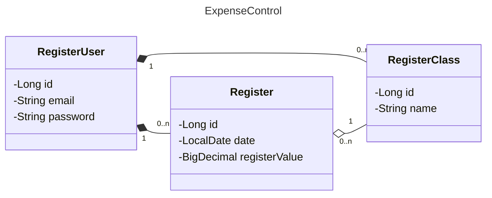
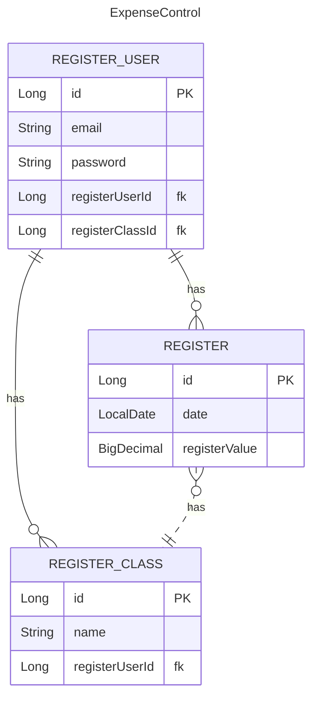

# About
An basic expense control app presented as final project of santander bootcamp by Digital Innovation One.
## Deploy
Deploy from the fullstack application can be tested on this [site](https://expensecontrol-omptr9n0.b4a.run).\
The deploy was made on the [Back4App](https://back4app.com) platform.
## Stack
- Frontend: Angular
- Backend: Spring Boot
## Features
- [x] Add transactions divided by income and outcome
- [x] History from transactions with balance and separated by income and outcome
- [x] Login and create and display data by user
- [x] Add class to categorize transactions
## Enhacements
- [ ] Improve precision on money representation
- [ ] Add history by class
- [ ] Improve security (sanitize inputs, implements jwt token)
- [ ] Add error treatment on frontend and backend
- [ ] Add tests
- [ ] Improve performance (sql queries, page loading)
- [ ] Add backend api documentation with swagger
- [ ] Add frontend documentation (jsdoc maybe)
- [ ] Improve design
- [ ] Improve responsiveness
## Changelog
This software uses [Conventional Commits](https://www.conventionalcommits.org/) and [Semantic Versioning](https://semver.org/).\
The changelog is auto generated with [Commit-And-Tag-Version](https://www.npmjs.com/package/commit-and-tag-version) lib.\
You can check the changelog [here](https://github.com/denisoncorbal/projeto-final-santander-bootcamp/blob/main/CHANGELOG.md).
## UML
Some diagrams used to design the software.
### Class diagram (backend)

### Entity relation diagram (backend)

## Screens
Here you can see the look from the software pages.\

